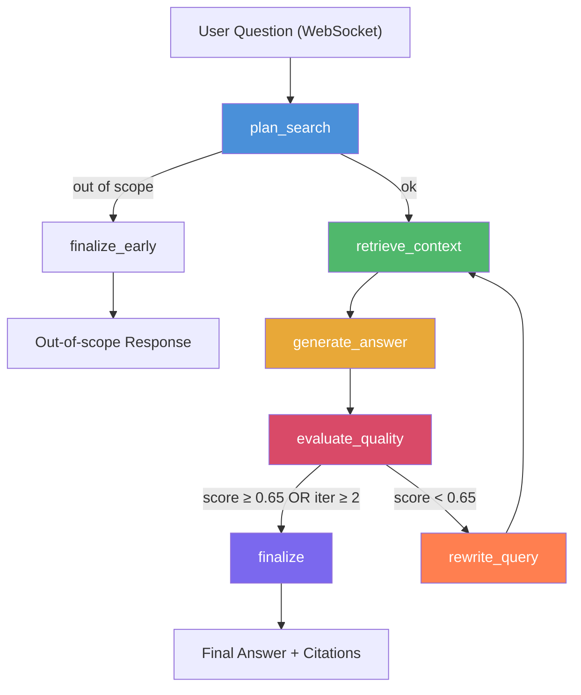
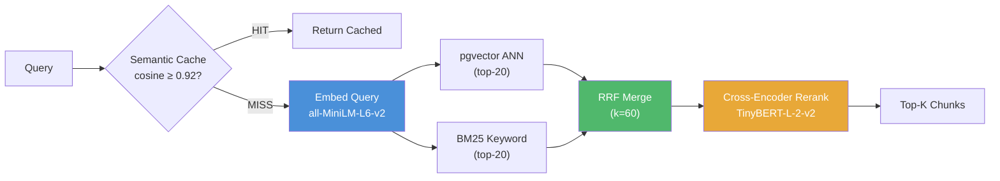

# AlphaLens

Agentic AI equity research assistant powered by a self-correcting LangGraph pipeline. Ask financial questions about public companies — the system retrieves context from SEC 10-K filings and earnings transcripts, generates a grounded answer with citations, evaluates its own confidence, and retries if quality is low.

## Architecture

### LangGraph Pipeline



### RAG Search Pipeline



## Tech Stack

| Layer | Technology |
|-------|-----------|
| **Backend** | FastAPI + asyncpg + LangGraph |
| **Frontend** | React 18 + Vite + TypeScript + Tailwind CSS |
| **Database** | PostgreSQL (Railway) + pgvector extension |
| **LLM (Primary)** | DeepSeek V3 (`deepseek-chat`) |
| **LLM (Secondary)** | Cerebras Qwen-3-235B |
| **LLM (Fallback)** | OpenAI GPT-4.1-mini |
| **Embeddings** | all-MiniLM-L6-v2 (384-dim, CPU) |
| **Reranking** | ms-marco-TinyBERT-L-2-v2 (cross-encoder) |
| **Keyword Search** | BM25 Okapi |
| **Observability** | LangSmith (optional) |
| **Auth** | Clerk (wired, disabled by default) |

## Quick Start

### Prerequisites
- Python 3.12+
- Node.js 18+
- PostgreSQL with pgvector extension (or Railway instance)

### Setup

```bash
# Clone
git clone https://github.com/swapnil18800/alphalens.git
cd alphalens

# Python environment
python -m venv .venv
source .venv/bin/activate       # Linux/Mac
# .venv\Scripts\activate        # Windows
pip install -r requirements.txt

# Environment
cp .env.example .env
# Fill in: DATABASE_URL, DEEPSEEK_API_KEY (and/or CEREBRAS_API_KEY, OPENAI_API_KEY)

# Frontend
cd frontend && npm install && cd ..
```

### Run

```bash
# Terminal 1: Backend
python -m uvicorn app:app --reload --port 8000

# Terminal 2: Frontend
cd frontend && npm run dev    # → http://localhost:5175
```

Vite proxies `/api`, `/sessions`, `/health`, and `/ws` to the backend at `:8000`.

## Data Ingestion

Before the RAG pipeline can answer questions, you need to populate the database:

```bash
# SEC 10-K filings (2-3 hours for all tickers)
python scripts/ingestion/ingest_sec.py --start-year 2023 --end-year 2025 --replace

# yfinance earnings summaries (20-30 min)
python scripts/ingestion/ingest_yfinance.py --start-quarter "Q1 2023" --end-quarter "Q4 2025" --replace

# StockAnalysis financial data
python scripts/ingestion/ingest_stockanalysis.py
```

See `data/tickers.txt` for the list of tracked companies.

## Evaluation Suite

The `evals/qa_eval/` directory contains a comprehensive evaluation harness for measuring RAG quality.

### Structure

```
evals/qa_eval/
├── question_vN.txt              # Question sets (JSON) with categories, web_search flags, ground_truth_map
├── generate_ground_truth.py     # Populates ground_truth_map: extracts tickers → queries DB → GPT-4o synthesis
├── run_eval.py                  # Runs pipeline on each question, computes M1-M8 metrics
├── results/
│   └── <timestamp>/             # One directory per eval run
│       ├── 01_category_question.json   # Per-question: answer, citations, all 8 metric scores, reasoning
│       ├── _summary.json               # Aggregated scores by category + overall average
│       └── _analysis.md                # Top/bottom performers, category insights
└── docs/                        # Historical tracking: IMPROVEMENT_SUMMARY_*.md, PLAN_C_RESULTS.md
```

### Metrics (M1-M8)

| Metric | What it measures | LLM needed? |
|--------|-----------------|-------------|
| M1 | Factual correctness (key facts found in answer) | No |
| M2 | Faithfulness (RAGAS — answer grounded in context) | Yes (GPT-4o) |
| M3 | Retrieval recall (key facts in top-K chunks) | No |
| M4 | Context precision (RAGAS — chunks are relevant) | Yes (GPT-4o) |
| M6 | Routing accuracy (web_search flag alignment) | No |
| M7 | Judge score (LLM verdict: pass/partial/fail) | Yes (GPT-4o) |
| M8 | Latency + confidence calibration | No |

### Running Evals

```bash
# Generate ground truth for a question set
python evals/qa_eval/generate_ground_truth.py --input "question_v4.txt" --full

# Smoke test (first 3 questions)
python evals/qa_eval/run_eval.py --smoke --input "question_v4.txt"

# Full eval
python evals/qa_eval/run_eval.py --full --input "question_v4.txt"
```

## Documentation

- [Architecture](docs/ARCHITECTURE.md) — System design, data flow, component map
- [RAG Model Pipeline](docs/RAG_MODEL_PIPELINE.md) — All models used at each stage with rationale
- [Directory Structure](docs/DIRECTORY_STRUCTURE.md) — Complete repo layout with file purposes
- [How to Run](docs/HOW_TO_RUN.md) — Setup and deployment guide

## Deployment

Configured for Railway:

```bash
# Build frontend
cd frontend && npm run build && cd ..

# Railway uses Procfile:
web: uvicorn app:app --host 0.0.0.0 --port $PORT --workers 1
```

FastAPI serves the React SPA from `frontend/dist` in production.
