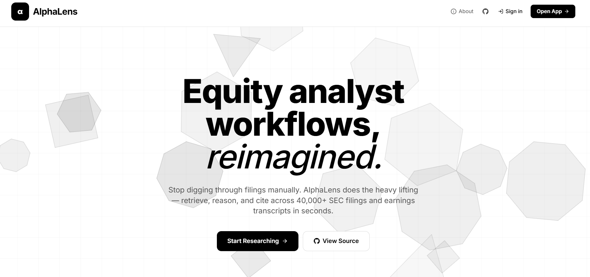
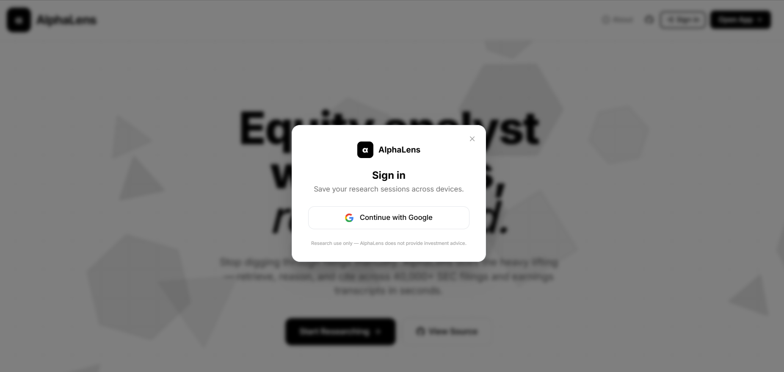
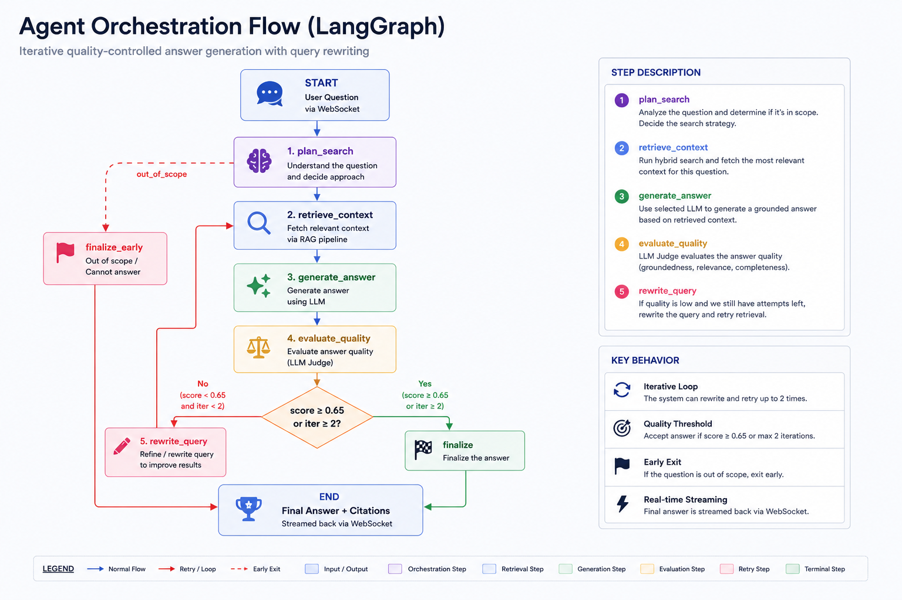
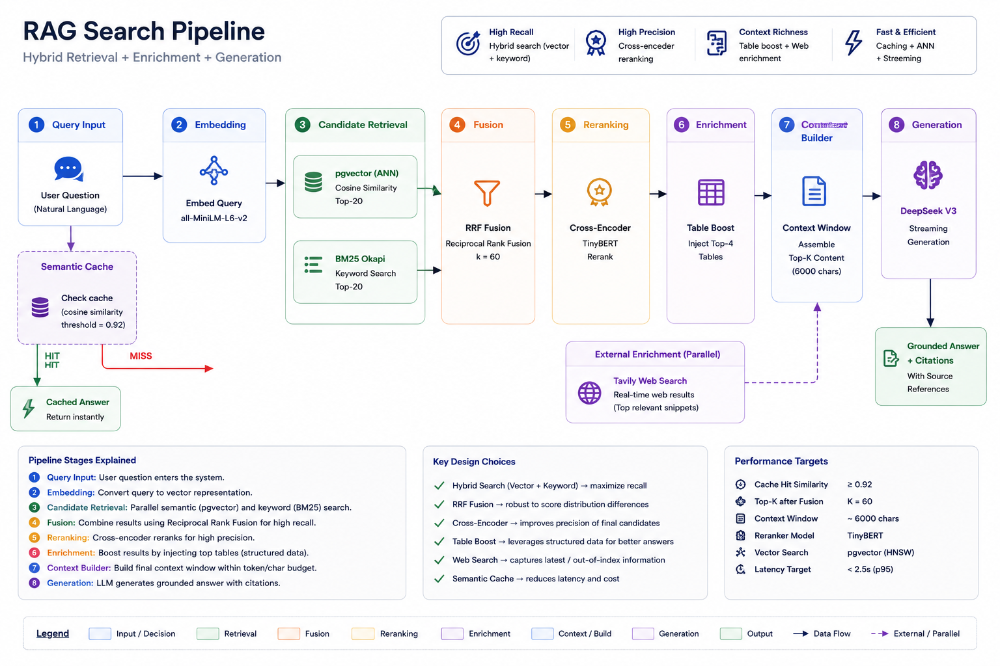
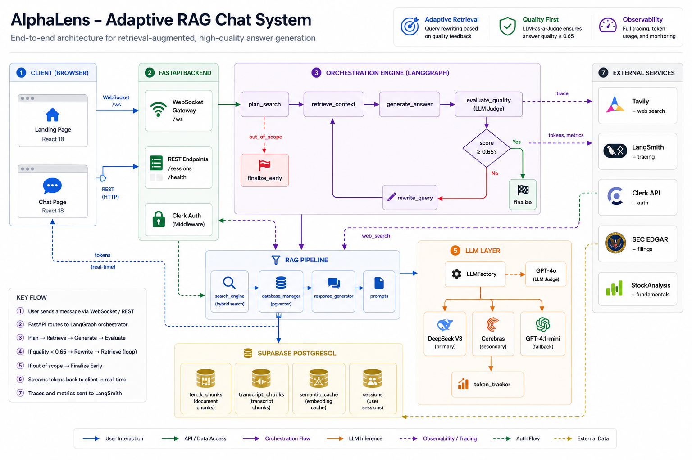

# AlphaLens

**Agentic AI equity research assistant.** Ask financial questions about public companies — AlphaLens retrieves context from SEC 10-K filings and earnings call transcripts, generates a grounded, cited answer, evaluates its own confidence, and automatically retries with a rewritten query if the quality is low.

🌐 **Live:** [alphalens-production-15e1.up.railway.app](https://alphalens-production-15e1.up.railway.app)

---

## Screenshots

<div align="center">
<table>
<tr>
<td align="center" width="300"><a href="assets/website-ss/homepage.png"></a><br/><sub><b>Landing Page</b></sub></td>
<td align="center" width="300"><a href="assets/website-ss/auth.png"></a><br/><sub><b>Auth Modal (Clerk)</b></sub></td>
<td align="center" width="300"><a href="assets/website-ss/chat_answer_formmatted.png"></a><br/><sub><b>Formatted Answer</b></sub></td>
<td align="center" width="300"><a href="assets/website-ss/chat_reasoning.png"></a><br/><sub><b>Reasoning Trace</b></sub></td>
<td align="center" width="300"><a href="assets/website-ss/citations.png"></a><br/><sub><b>Citations Panel</b></sub></td>
</tr>
</table>
</div>

> Scroll the table horizontally to see all screenshots. Click any image to enlarge.

---

## How It Works

### LangGraph Multi-Agent Orchestration Pipeline



### RAG Search Pipeline



---

## Architecture

### System Architecture Diagram


 
---

## Tech Stack

| Layer | Technology |
|-------|-----------|
| **Backend** | FastAPI + asyncpg + LangGraph |
| **Frontend** | React 18 + Vite + TypeScript + Tailwind CSS + framer-motion |
| **Database** | Supabase PostgreSQL + pgvector extension |
| **LLM (Primary)** | DeepSeek V3 (`deepseek-chat`) — no daily quota, 35× cheaper than GPT-4o |
| **LLM (Secondary)** | Cerebras Qwen-3-235B — fast inference, daily quota |
| **LLM (Fallback)** | OpenAI GPT-4.1-mini — generation fallback |
| **Eval Judge** | OpenAI GPT-4o — consistent eval scoring |
| **Embeddings** | `all-MiniLM-L6-v2` (384-dim, CPU-fast, ~2ms/query) |
| **Reranking** | `ms-marco-TinyBERT-L-2-v2` (cross-encoder) |
| **Keyword Search** | BM25 Okapi (in-memory, built at startup) |
| **Web Search** | Tavily API (HTML-cleaned, 8s timeout) |
| **Auth** | Clerk (wired, disabled by default) |
| **Observability** | LangSmith (optional, via `LANGCHAIN_TRACING_V2=true`) |
| **Hosting** | Railway (app) + Supabase (database) |

---

## Data Coverage

| Source | Coverage | Chunks | Vector Coverage |
|--------|---------|--------|----------------|
| SEC 10-K Filings | **27 companies** · FY2023–FY2026 | **31,911** | 100% embedded |
| Earnings Transcripts | **27 companies** · Q1 2023–Q4 2026 | **16,704** | 100% embedded |

Companies: NVDA, AAPL, MSFT, GOOGL, AMZN, META, TSLA, AMD, INTC, NFLX, UBER, IBM, CRM, ORCL, ADBE, QCOM, PANW, PYPL, PLTR, AVGO, CSCO, SNOW, AMAT, LRCX, MU, NOW, TXN

> Data last audited 2026-05-07 via `db/generate_data_audit.py` · See [DATA_AUDIT_SEC_TRANSCRIPTS.md](docs/DATA_AUDIT_SEC_TRANSCRIPTS.md) for full coverage heatmap.

See [docs/DATA_AUDIT_SEC_TRANSCRIPTS.md](docs/DATA_AUDIT_SEC_TRANSCRIPTS.md) for the full coverage heatmap and per-ticker breakdown.

---

## Evaluation Results

The pipeline has been measured across 6 evaluation sessions using an 8-metric harness (M1–M8: factual correctness, RAGAS faithfulness, retrieval recall, context precision, routing accuracy, LLM judge).

| Version | Questions | Score | Notes |
|---------|-----------|-------|-------|
| Baseline | v1 (24 Qs) | **0.546** | Raw pipeline, no tuning |
| Post-table-boost | v2 (20 Qs) | **0.685** | Table chunk injection fix |
| Post-DeepSeek switch | v2+v3 | **0.784** | DeepSeek V3 as primary LLM |
| Session 6 final | v2+v3 (40 Qs) | **0.773** | Stable production baseline |
| v4 (harder Qs) | v4 (30 Qs) | **0.550** | Honest score; harder questions |

**Routing accuracy:** 1.00 (100%, stable across all 70 questions)  
**Hallucination control:** 1.00 (never fabricates for private/unknown companies)

See [docs/EVALUATION_RESULTS.md](docs/EVALUATION_RESULTS.md) for the full story, or [docs/evaluation_summary.md](docs/evaluation_summary.md) for the blog-style writeup.

### LangSmith Trace Visualization

End-to-end distributed traces showing the three core execution paths:

<div align="center">
<table>
<tr>
<td align="center" width="300"><a href="assets/traces/langsmith-web.png"></a><br/><sub><b>Web Search Path</b><br/>Direct finalization with Tavily</sub></td>
<td align="center" width="300"><a href="assets/traces/langsmith-finalise-early.png"></a><br/><sub><b>Out-of-Scope Path</b><br/>Finalize early (no retrieval)</sub></td>
<td align="center" width="300"><a href="assets/traces/langsmith-retry.png"></a><br/><sub><b>Retry Loop Path</b><br/>Low eval score → rewrite_query</sub></td>
</tr>
</table>
</div>

> Hover or click any image to enlarge. Traces captured via LangSmith with token cost tracking and latency metrics.

---

## Quick Start

### Prerequisites
- Python 3.12+
- Node.js 18+
- Supabase PostgreSQL instance with pgvector extension

### Setup

```bash
# Clone
git clone https://github.com/swapnil18800/alphalens.git
cd alphalens

# Python environment
python -m venv .venv
.venv\Scripts\activate          # Windows
# source .venv/bin/activate     # Linux/Mac
pip install -r requirements.txt

# Environment
cp .env.example .env
# Fill in: DATABASE_URL, DEEPSEEK_API_KEY (and/or CEREBRAS_API_KEY, OPENAI_API_KEY)

# Frontend
cd frontend && npm install && cd ..
```

### Run

```bash
# Terminal 1: Backend
python -m uvicorn app:app --reload --port 8000

# Terminal 2: Frontend
cd frontend && npm run dev    # → http://localhost:5175
```

Vite proxies `/api`, `/sessions`, `/health`, `/ws`, and `/logos` to the backend at `:8000`.

---

## Data Ingestion

Populate Supabase before the RAG pipeline can answer questions:

```bash
# 1. Apply schema (once)
python db/setup_db.py

# 2. SEC 10-K filings (2-3 hours for all tickers)
python db/ingestion/ingest_sec.py --start-year 2023 --end-year 2025 --replace

# 3. Earnings transcripts via StockAnalysis.com (several hours, primary transcript source)
python db/ingestion/ingest_stockanalysis.py

# 4. Generate data audit report
python db/generate_data_audit.py
```

See `db/ingestion/tickers.txt` for the list of tracked companies.

---

## Evaluation Suite

The `evals/qa_eval/` directory contains a comprehensive evaluation harness for measuring RAG quality across 8 metrics.

```bash
# Generate ground truth for a question set
python evals/qa_eval/generate_ground_truth.py --input "question_v4.txt" --full

# Smoke test (first 3 questions)
python evals/qa_eval/run_eval.py --smoke --input "question_v4.txt"

# Full eval
python evals/qa_eval/run_eval.py --full --input "question_v4.txt"
```

### Metrics (M1–M8)

| Metric | What it measures | LLM needed? |
|--------|-----------------|-------------|
| M1 | Factual correctness (key facts in answer) | No |
| M2 | RAGAS faithfulness (answer grounded in context) | Yes (GPT-4o) |
| M3 | Retrieval recall (key facts in top-K chunks) | No |
| M4 | RAGAS context precision (chunks are relevant) | Yes (GPT-4o) |
| M6 | Routing accuracy (web_search flag alignment) | No |
| M7 | GPT-4o judge score (pass / partial / fail) | Yes (GPT-4o) |

---

## Documentation

| Doc | Description |
|-----|-------------|
| [ARCHITECTURE.md](docs/ARCHITECTURE.md) | System design, mermaid diagrams, WS data flow, component map |
| [RAG_MODEL_PIPELINE.md](docs/RAG_MODEL_PIPELINE.md) | Every model, prompt, search heuristic, and optimization in the RAG pipeline |
| [EVALUATION_RESULTS.md](docs/EVALUATION_RESULTS.md) | Complete eval history across 6 sessions (0.546 → 0.784) |
| [evaluation_summary.md](docs/evaluation_summary.md) | Blog-style Medium writeup of the eval journey |
| [DATA_AUDIT_SEC_TRANSCRIPTS.md](docs/DATA_AUDIT_SEC_TRANSCRIPTS.md) | Coverage heatmap, chunk counts, data quality notes |
| [DIRECTORY_STRUCTURE.md](docs/DIRECTORY_STRUCTURE.md) | Full repo layout with file-level descriptions |
| [HOW_TO_RUN.md](docs/HOW_TO_RUN.md) | Local setup + Railway deployment guide |

---

## Deployment

Configured for Railway (app) + Supabase (database):

```bash
# Build frontend
cd frontend && npm run build && cd ..

# Railway uses Procfile:
web: uvicorn app:app --host 0.0.0.0 --port $PORT --workers 1
```

FastAPI serves the React SPA from `frontend/dist` in production. Company logos (`/logos`) and tech stack logos (`/stack_logos`) are served as static mounts.

---

*Built with LangGraph · DeepSeek V3 · pgvector · BM25 · Sentence Transformers · FastAPI · React · Supabase · Railway*

If this project helped you, consider giving it a ⭐

---

## Contributor

<table>
<tr>

<td align="center">
  <a href="https://github.com/swapnil18800">
    
    <br />
    <sub><b>Swapnil Padhi</b></sub>
  </a>
</td>

<td align="center">
  <a href="https://claude.ai">
    
    <br />
    <sub><b>Claude</b></sub>
  </a>
</td>

</tr>
</table>

---

## License

This project is licensed under the MIT License.

See the [LICENSE](LICENSE) file for details.

---

<p align="center">
  Built with Sukku Coffee, confusion, and brain-rotting amounts of debugging and improving evaluation loops.
</p>