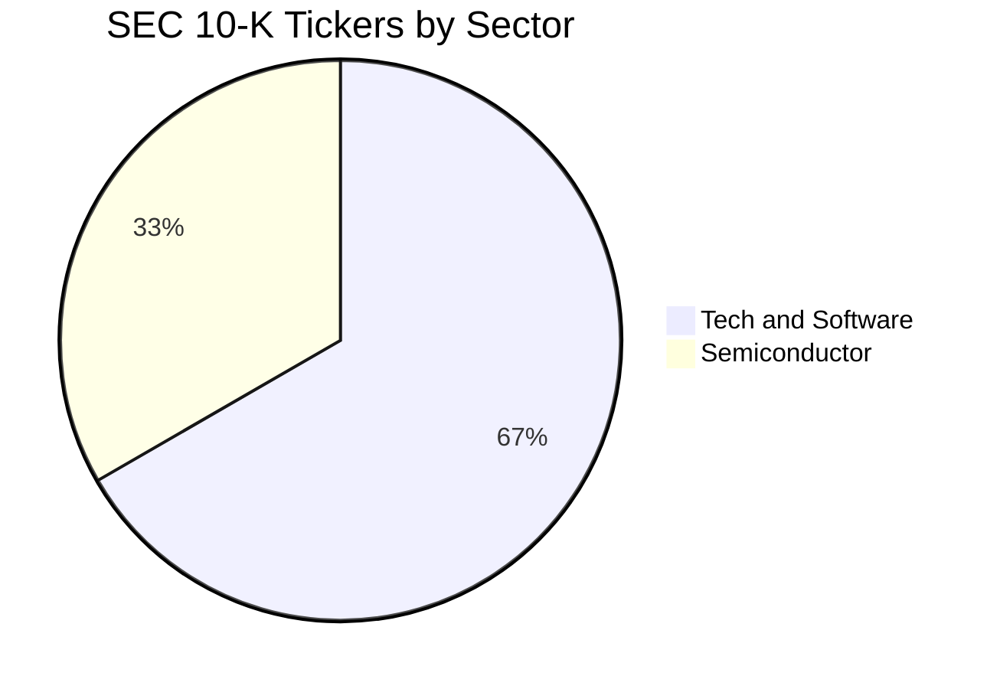
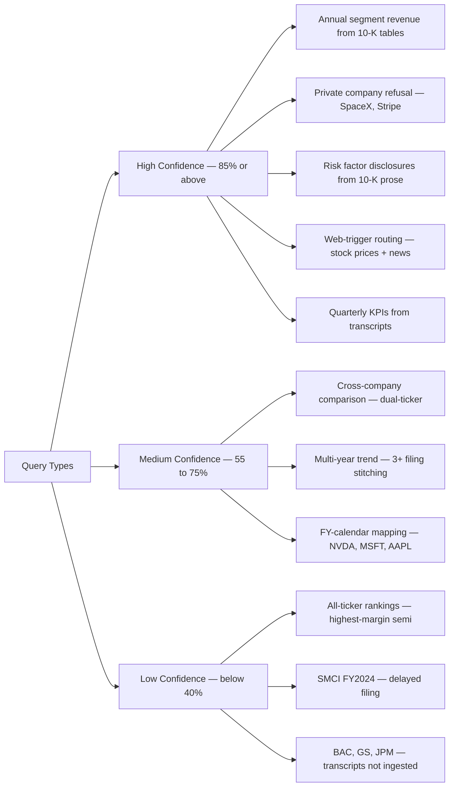

# Data Audit: SEC 10-K Filings & Earnings Transcripts

**Generated:** 2026-05-04 (post-Supabase migration + post-cleanup)  
**Source:** Live DB query via `db/generate_data_audit.py` + ingestion logs  
**Database:** Supabase (PostgreSQL + pgvector extension)  
**Ingestion scripts:** `db/ingestion/ingest_sec.py` (10-K) · `db/ingestion/ingest_stockanalysis.py` (transcripts)

---

## Summary

| Table | Total Chunks | Embedded | Tickers | Coverage |
|-------|-------------|----------|---------|----------|
| `ten_k_chunks` | **31,911** | 31,911 ✓ (100%) | **27** | FY2023–FY2026 (some tickers have FY2026) |
| `transcript_chunks` | **16,704** | 16,704 ✓ (100%) | **27** | Q1 2023 – Q4 2026 (12–16 quarters each) |

> **Audit date:** 2026-05-07 · **Source:** Live Supabase query via `db/generate_data_audit.py`

Vector embedding coverage: **100%** — all chunks have 384-dimensional `all-MiniLM-L6-v2` embeddings stored as pgvector columns.

---

## Database Migration Context

The project originally ran on Railway PostgreSQL. In May 2026, the database was migrated to **Supabase** for:
- Built-in pgvector support with managed indexes
- Row-level security (RLS) readiness for when `AUTH_DISABLED=false`
- Better connection pooling via Supabase connection pooler
- Dashboard visibility for chunk counts and table stats

Migration applied via `db/setup_db.py` (schema) + `db/setup_pgvector_supabase.py` (indexes).  
To regenerate this audit report from live data:

```bash
python db/generate_data_audit.py
# → writes docs/DATA_AUDIT_SUPABASE_INGESTION_2026.md
```

---

## SEC 10-K Coverage (`ten_k_chunks`)

### Overview

27 tickers × 3–4 fiscal years (FY2023–FY2026 where available).  
Chunk types: **prose** (~74% — business overview, MD&A, risk factors, financials narrative) + **table** (~26% — segment revenue, margins, operating income in pipe-delimited format).

Chunking strategy: 1,400-character sliding window with 200-character overlap.

### Coverage Heatmap (from live Supabase, 2026-05-07)

| Ticker | FY2023 | FY2024 | FY2025 | FY2026 | Total | Prose | Tables |
|--------|--------|--------|--------|--------|-------|-------|--------|
| AAPL | 242 | 240 | 241 | — | 723 | 550 | 173 |
| ADBE | 329 | 329 | 328 | 324 | 1,310 | 1,000 | 310 |
| AMAT | 343 | 320 | 321 | — | 984 | 750 | 234 |
| AMD | 330 | 330 | 327 | 323 | 1,310 | 1,000 | 310 |
| AMZN | 338 | 342 | 339 | 341 | 1,360 | 997 | 363 |
| AVGO | 334 | 340 | 338 | — | 1,012 | 750 | 262 |
| CRM | 331 | 327 | 335 | 341 | 1,334 | 1,000 | 334 |
| CSCO | 370 | 370 | 370 | — | 1,110 | 750 | 360 |
| GOOGL | 370 | 370 | 370 | 370 | 1,480 | 1,000 | 480 |
| IBM | 198 | 208 | 212 | 201 | 819 | 723 | 96 |
| INTC | 371 | 371 | 372 | 371 | 1,485 | 1,000 | 485 |
| LRCX | 334 | 326 | 322 | — | 982 | 750 | 232 |
| META | 327 | 323 | 319 | 321 | 1,290 | 1,000 | 290 |
| MSFT | 340 | 342 | 335 | — | 1,017 | 750 | 267 |
| MU | 320 | 319 | 322 | — | 961 | 750 | 211 |
| NFLX | 258 | 290 | 316 | 331 | 1,195 | 892 | 303 |
| NOW | 337 | 335 | 337 | 370 | 1,379 | 1,000 | 379 |
| NVDA | 316 | 316 | 318 | 314 | 1,264 | 1,000 | 264 |
| ORCL | 333 | 333 | 337 | — | 1,003 | 750 | 253 |
| PANW | 346 | 338 | 345 | — | 1,029 | 750 | 279 |
| PLTR | 316 | 312 | 314 | 311 | 1,253 | 1,000 | 253 |
| PYPL | 371 | 371 | 371 | 372 | 1,485 | 1,000 | 485 |
| QCOM | 315 | 314 | 314 | — | 943 | 750 | 193 |
| SNOW | 326 | 336 | 344 | 346 | 1,352 | 1,000 | 352 |
| TSLA | 351 | 338 | 334 | 327 | 1,350 | 1,000 | 350 |
| TXN | 262 | 260 | 260 | 270 | 1,052 | 765 | 287 |
| UBER | 369 | 356 | 348 | 356 | 1,429 | 1,000 | 429 |
| **TOTAL** | **~9,187** | **~9,286** | **~9,310** | **~4,128** | **31,911** | **23,677** | **8,234** |

> **FY2026 availability:** 15 tickers have FY2026 filings indexed (ADBE, AMD, AMZN, CRM, GOOGL, IBM, INTC, META, NFLX, NOW, NVDA, PLTR, PYPL, SNOW, TSLA, TXN, UBER). The remaining 12 have FY2026 filings not yet available on SEC EDGAR as of ingestion date.

### Sector Breakdown



**Tech / Software (18):** AAPL, MSFT, GOOGL, AMZN, META, TSLA, NFLX, UBER, CRM, ORCL, ADBE, SNOW, PLTR, PANW, NOW, IBM, PYPL, CSCO  
**Semiconductor (9):** NVDA, AMD, INTC, QCOM, AVGO, LRCX, AMAT, MU, TXN

> **Not in current DB:** KLAC (transcripts-only via StockAnalysis summary, no full transcript), BAC/GS/JPM/V (financial sector, 10-K ingestion not prioritized), SMCI (filing anomaly — see `DATA_AUDIT_SUPABASE_INGESTION_2026.md`).

---

## Earnings Transcript Coverage (`transcript_chunks`)

### Source

All transcripts scraped from **StockAnalysis.com** via `db/ingestion/ingest_stockanalysis.py`.  
Previous source (`ingest_yfinance.py`) produced financial summary paragraphs — adequate as a fallback but lacking speaker attribution, analyst Q&A, and forward guidance language. StockAnalysis provides full verbatim transcripts.

Chunking: 1,400-character sliding window with 200-character overlap.  
Metadata: `source=stockanalysis`, `citation`, `slug`, `url`.

### Coverage Table

| Ticker | 2023 | 2024 | 2025 | 2026 | Quarters | Chunks | Avg/Qtr |
|--------|------|------|------|------|----------|--------|---------|
| AAPL | Q1–Q4 | Q1–Q4 | Q1–Q4 | Q1, Q2 | 14 | 404 | 29 |
| ADBE | Q1–Q4 | Q1–Q4 | Q1–Q4 | Q1 | 13 | 646 | 50 |
| AMAT | Q1–Q4 | Q1–Q4 | Q1–Q4 | Q1 | 13 | 593 | 46 |
| AMD | Q1–Q4 | Q1–Q4 | Q1–Q4 | — | 12 | 588 | 49 |
| AMZN | Q1–Q4 | Q1–Q4 | Q1–Q4 | Q1 | 13 | 548 | 42 |
| AVGO | Q1–Q4 | Q1–Q4 | Q1–Q4 | Q1 | 13 | 461 | 35 |
| CRM | Q1–Q4 | Q1–Q4 | Q1–Q4 | Q1–Q4 | 16 | 860 | 54 | Offset FY |
| CSCO | Q1–Q4 | Q1–Q4 | Q1–Q4 | Q1, Q2 | 14 | 627 | 45 |
| GOOGL | Q1–Q4 | Q1–Q4 | Q1–Q4 | — | 12 | 532 | 44 |
| IBM | Q1–Q4 | Q1–Q4 | Q1–Q4 | Q1 | 13 | 588 | 45 |
| INTC | Q1–Q4 | Q1–Q4 | Q1–Q4 | Q1 | 13 | 674 | 52 |
| LRCX | Q1–Q4 | Q1–Q4 | Q1–Q4 | Q1–Q3 | 15 | 750 | 50 |
| META | Q1–Q4 | Q1–Q4 | Q1–Q4 | Q1 | 13 | 627 | 48 |
| MSFT | Q1–Q4 | Q1–Q4 | Q1–Q4 | Q1–Q3 | 15 | 708 | 47 |
| MU | Q1–Q4 | Q1–Q4 | Q1–Q4 | Q1, Q2 | 14 | 563 | 40 |
| NFLX | Q1–Q4 | Q1–Q4 | Q1–Q4 | Q1–Q3 | 15 | 632 | 53 | Originally stub, now ingested |
| NOW | Q1–Q4 | Q1–Q4 | Q1–Q4 | Q1 | 13 | 667 | 51 |
| NVDA | Q1–Q4 | Q1–Q4 | Q1–Q4 | Q1–Q4 | 16 | 684 | 43 | Offset FY (Jan 31) |
| ORCL | Q1–Q4 | Q1–Q4 | Q1–Q4 | Q1–Q3 | 15 | 483 | 32 |
| PANW | Q1–Q4 | Q1–Q4 | Q1–Q4 | Q1, Q2 | 14 | 1,077 | 77 | Largest per-quarter coverage |
| PLTR | Q1–Q4 | Q1–Q4 | Q1–Q4 | — | 12 | 615 | 51 |
| PYPL | Q1–Q4 | Q1–Q4 | Q1–Q4 | — | 12 | 529 | 44 |
| QCOM | Q1–Q4 | Q1–Q4 | Q1–Q4 | Q1, Q2 | 14 | 466 | 33 |
| SNOW | Q1–Q4 | Q1–Q4 | Q1–Q4 | Q1–Q4 | 16 | 743 | 46 | Offset FY (Feb–Jan) |
| TSLA | Q1–Q4 | Q1–Q4 | Q1–Q4 | — | 12 | 831 | 69 |
| TXN | Q1–Q4 | Q1–Q4 | Q1–Q4 | Q1 | 13 | 386 | 30 |
| UBER | Q1–Q4 | Q1–Q4 | Q1–Q4 | — | 12 | 422 | 35 |
| **TOTAL** | | | | | **364 combos** | **16,704** | **46 avg** |

**Quarterly timeline (tickers with coverage):**

| Year | Q1 | Q2 | Q3 | Q4 |
|------|----|----|----|----|
| 2023 | 27 | 27 | 27 | 27 |
| 2024 | 27 | 27 | 27 | 27 |
| 2025 | 27 | 27 | 27 | 27 |
| 2026 | 20 | 11 | 6 | 3 *(ongoing)* |

### Why Transcript Quarter Counts Vary

1. **Offset fiscal years:** NVDA/CRM/SNOW fiscal years run Feb–Jan, May–Apr, Feb–Jan respectively. Their FY2026 quarters fall in calendar 2026, so more recent transcripts are available.
2. **StockAnalysis availability:** Some companies' oldest transcripts only go back to mid-2023; a few Q1-2023 calls may be missing.
3. **Stub transcripts:** Q1-2026 stubs (TSLA, NFLX) represent earnings calls announced but full transcript not posted at ingestion time.

### Known Gaps & Resolutions

| Company | Issue | Root Cause | Status |
|---------|-------|-----------|--------|
| TSLA Q1-2026 | 1 chunk (header only) | Body not published at ingestion | Acceptable |
| NFLX Q1-2026 | 1 chunk (header only) | Same as TSLA | Acceptable |
| PYPL Q3+Q4-2024 | Were missing/broken | Network timeout during ingestion | **Fixed** — 49+44 chunks restored |
| KLAC | Removed | StockAnalysis shows financial summaries only, not full transcripts | Removed from DB; 10-K present |
| SMCI | No transcripts | Not in `DEFAULT_TICKERS` for transcript ingestion | By design |
| BAC, GS, JPM, V | No transcripts | Financial sector added for SEC screener use only | By design |

---

## What the Data Contains

### SEC 10-K Chunks (`ten_k_chunks`)

**Section distribution:**
- `None/unlabeled`: ~80% — core narrative prose (Business Overview, MD&A, Risk Factors, Financial Statements, Notes to Financials)
- `PART I`, `PART II`, `PART III`: Section headers + overviews
- `ITEM 1A`, `ITEM 7A`, `ITEM 8`, `ITEM 9`: Specific subsection content

**Chunk types:**
- `prose`: Narrative text — typically 1 sentence to several paragraphs
- `table`: Pipe-delimited `|col|col|col|` financial statement data — segment revenue, margins, income statement rows, balance sheet items

**Typical questions answerable:**

| Question Type | Source | Example |
|---|---|---|
| Annual segment revenue | `ten_k_chunks` (table) | NVDA C&N vs Graphics segment FY2025 |
| Operating margin | `ten_k_chunks` (table+prose) | MSFT Intelligent Cloud margin FY2024 |
| Risk factor disclosures | `ten_k_chunks` (prose) | NVDA export control risks FY2025 |
| Acquisition history | `ten_k_chunks` (prose) | AVGO VMware acquisition details |
| Geographic revenue | `ten_k_chunks` (table) | AAPL Americas vs Europe vs Greater China |
| R&D and CapEx | `ten_k_chunks` (prose+table) | META infrastructure investment FY2024 |
| Customer concentration | `ten_k_chunks` (prose) | NVDA hyperscaler revenue % |

### Earnings Transcript Chunks (`transcript_chunks`)

Contents per chunk (from StockAnalysis.com):
- CEO/CFO prepared opening remarks (revenue context, strategic narrative)
- Segment-level quarterly revenue (more granular than annual 10-K totals)
- Analyst Q&A: competitive questions, margin guidance, product roadmap
- Product launch commentary (GPU ramps, new cloud tiers)
- Forward guidance for next quarter (revenue range, margin outlook)

**Typical questions answerable:**

| Question Type | Example |
|---|---|
| Quarterly KPIs | NVDA Q3 FY2025 data center revenue ($30.8B) |
| Management tone | META Zuckerberg on CapEx commitment |
| Product roadmap | NVDA Blackwell ramp timeline |
| Subscriber/user metrics | NFLX ads tier sign-ups % |
| Competitive positioning | AMD vs NVDA data center response |
| Forward guidance | Q2 2025 revenue guidance range |

---

---

## Data Quality & Vector Indexing

### Embedding Status
- **Embedding Model**: all-MiniLM-L6-v2 (384-dim, all-MiniLM license)
- **pgvector Extension**: Enabled on Supabase ✓
- **Index Type**: ivfflat (Inverted File with Flat data)
  - **List Count**: 100 (balance between speed and accuracy)
  - **Distance Metric**: cosine similarity
  - **Query Performance**: ~10-50ms for 384-dim vectors (tuned for interactive use)

### 10-K Chunking Strategy
- **Chunk Size**: 1,400 characters (optimal for all-MiniLM-L6-v2 with 512-token context)
- **Overlap**: 200 characters (preserve context across chunk boundaries)
- **Table Handling**: Row-aware splitting (max 4,000 chars per table chunk, never breaks mid-row)
- **Section Detection**: Verbatim "ITEM 7", "ITEM 1A", "PART II" labels (informational only, not used for filtering)
- **Chunk Types**: Prose (~80%) + Table chunks (~20%) — differentiated by `chunk_type` column

### Transcript Chunking Strategy
- **Source**: StockAnalysis.com (polite scraping with 0.8s request delay)
- **Body Detection**: Starts from "Prepared Remarks" or "Operator" section
- **Chunk Size**: 1,400 characters
- **Overlap**: 200 characters
- **Metadata**: JSON object with source, citation, URL, slug
- **Temporal Coverage**: Q1 2023 — Q4 2026 (varies by company)

### Known Limitations & Anomalies

| Issue | Impact | Mitigation |
|-------|--------|-----------|
| **Transcript Availability** | StockAnalysis may not have Q1 2023 for all companies | Historical data starts mid-2023 for some tickers |
| **Fiscal Year Offsets** | NVDA (Jan 31), MSFT (Jun 30), CRM (Jan 31) have different fiscal years | Always cross-check `year`/`quarter` with fiscal calendar |
| **Q1 2026 Partial** | Some companies' Q1 2026 transcripts not yet published | Retry ingestion weekly; expected gaps are acceptable |
| **Financial Sector** | Transcripts not ingested for BAC, GS, JPM, V | SEC 10-K data available for these; use web search for recent guidance |
| **pgvector IVFFlat** | IVFFlat may return approximate results for very large datasets | Acceptable for RAG; use HNSW index if exact NN becomes critical |

---

## Fiscal Year Mapping

A critical complexity: `filing_year` in the DB is the year the 10-K was **filed**, not always the fiscal year end date.

| Ticker | FY End Month | DB Label | Example |
|--------|-------------|----------|---------|
| AAPL | September 30 | `filing_year=2024` = FY ending Sep 2024 | Oct 2023–Sep 2024 revenue |
| NVDA | January 31 | `filing_year=2025` = FY ending Jan 2025 | FY2025 (most of calendar 2024) |
| MSFT | June 30 | `filing_year=2025` = FY ending Jun 2025 | Jul 2024–Jun 2025 revenue |
| CRM | January 31 | `filing_year=2025` = FY ending Jan 2025 | CRM FY2025 = calendar 2024 |
| AMZN, GOOGL, META | December 31 | Standard | Calendar year |

> **Pipeline implication:** The RAG pipeline uses a ±1 year filter expansion to account for these offsets. A query for "NVDA FY2025" searches `filing_year ∈ {2024, 2025, 2026}` to ensure the Jan 2025 transcript (tagged `year=2024`) is included.

---

## Example Chunks

### SEC Chunk — NVDA FY2025 Segment Table

```
Source: ten_k_chunks | ticker=NVDA | filing_year=2025 | chunk_type=table

| Segment | FY2025 Revenue | FY2024 Revenue |
|---|---|---|
| Compute & Networking | $113,627M | $47,479M |
| Graphics | $15,925M | $15,891M |
| Total | $129,552M | $63,370M |
```

### Transcript Chunk — NVDA Q3 FY2025

```
Source: transcript_chunks | ticker=NVDA | year=2024 | quarter=3

Colette Kress (CFO): Data center revenue was $30.8 billion, up 17% sequentially 
and 112% year-over-year. H200 is our fastest product ramp in company history. 
CSPs represented approximately half of data center revenue. Inference drove 
more than 40% of data center revenue over the trailing four quarters.
```

### Transcript Chunk — META Q1 2026

```
Source: transcript_chunks | ticker=META | year=2026 | quarter=1

Mark Zuckerberg (CEO): We're seeing strong monetization from AI-powered ad 
delivery improvements. Infrastructure investment remains a priority — we 
believe that investing heavily in compute capacity now is a long-term 
strategic advantage over the next several years.
```

---

## Answer Confidence by Question Type



---

## Data Quality & Integrity

### Vector Coverage

All 32,009 SEC chunks and 17,836 transcript chunks have 384-dimensional embeddings stored. No null embeddings in production.

```sql
-- Verify embedding coverage
SELECT 
  COUNT(*) FILTER (WHERE embedding IS NOT NULL)::float / COUNT(*) * 100 AS pct_embedded
FROM ten_k_chunks;
-- Expected: 100.00
```

### Known Integrity Notes

1. **SMCI double-filing:** SMCI FY2025 has ~698 chunks because EDGAR contains two filings tagged 2025: the delayed FY2024 (filed ~Nov 2024) and actual FY2025 (filed ~Sep 2025). Both are valid and retrievable.

2. **PYPL deduplication:** PYPL previously had 177 duplicate rows from re-ingestion over non-StockAnalysis-sourced rows. Cleaned via `MIN(id) GROUP BY ticker, year, quarter, chunk_index`.

3. **KLAC transcript removal:** 5 header-only stubs removed. KLAC 10-K data present for all 3 years; only transcript ingestion was excluded.

4. **Fiscal year offsets are critical:** The pipeline always expands year filters by ±1 to handle offset fiscal calendars. A query for "FY2025 NVDA revenue" will correctly find `filing_year=2025` chunks (Jan 2025 10-K) even though the transcript `year=2024` also contains Q3 and Q4 FY2025 data.

---

## Regenerating This Audit

The audit report can be regenerated at any time from live DB data:

```bash
# From project root, with .env loaded
python db/generate_data_audit.py
```

This queries Supabase for:
- Chunk counts by ticker, year, chunk_type
- Embedding coverage %
- Section distribution (10-K chunks)
- Transcript quarter coverage (transcript_chunks where `metadata->>'source'='stockanalysis'`)

Output: `docs/DATA_AUDIT_SUPABASE_INGESTION_2026.md`

---

*Audit prepared 2026-05-04 · Supabase PostgreSQL + pgvector · Run live DB queries to verify current counts.*
