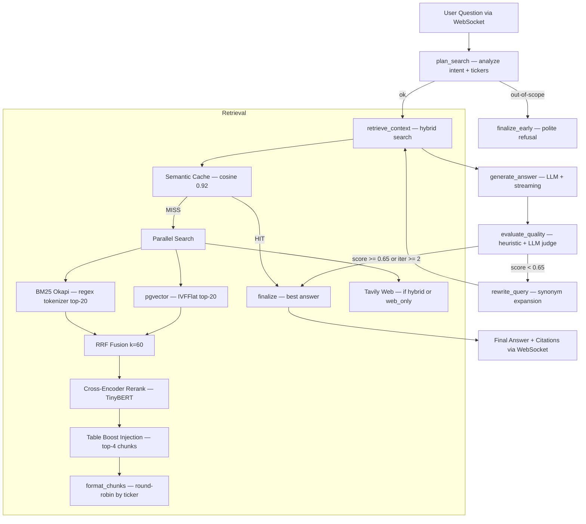

# AlphaLens — RAG Model Pipeline

> A complete technical reference for every model, algorithm, and design decision in the retrieval-augmented generation pipeline.

---

## Summary

AlphaLens answers financial research questions by fusing **semantic search**, **keyword search**, **cross-encoder reranking**, and **multi-provider LLM generation** into a single pipeline that self-evaluates and retries. The pipeline is orchestrated by a LangGraph state machine and designed to be grounded, cited, and hallucination-resistant.



---

## Table of Contents

1. [Query Analysis (plan_search)](#1-query-analysis-plan_search)
2. [Retrieval — Semantic Cache](#2-retrieval--semantic-cache)
3. [Retrieval — Query Embedding](#3-retrieval--query-embedding)
4. [Retrieval — pgvector Semantic Search](#4-retrieval--pgvector-semantic-search)
5. [Retrieval — BM25 Keyword Search](#5-retrieval--bm25-keyword-search)
6. [Retrieval — Web Search (Tavily)](#6-retrieval--web-search-tavily)
7. [Retrieval — Reciprocal Rank Fusion](#7-retrieval--reciprocal-rank-fusion)
8. [Retrieval — Cross-Encoder Reranking](#8-retrieval--cross-encoder-reranking)
9. [Retrieval — Table Boost & Format](#9-retrieval--table-boost--format)
10. [Response Generation — Context Building](#10-response-generation--context-building)
11. [Response Generation — LLM Chain](#11-response-generation--llm-chain)
12. [Response Generation — Prompts](#12-response-generation--prompts)
13. [Response Generation — Chunking Strategy](#13-chunking-strategy--table-handling)
14. [Self-Evaluation & Retry](#14-self-evaluation--retry)
15. [Query Rewriting](#15-query-rewriting)
16. [Citation Building](#16-citation-building)
17. [Semantic Caching (Write Path)](#17-semantic-caching-write-path)
18. [LLM Abstraction Layer](#18-llm-abstraction-layer)
19. [Token Tracking & Cost](#19-token-tracking--cost)
20. [LangSmith Tracing](#20-langsmith-tracing)
21. [Model Selection Rationale](#21-model-selection-rationale)
22. [Performance & Latency](#22-performance--latency)

---

## 1. Query Analysis (plan_search)

**File:** `agent/graph/nodes.py:node_analyze_question`  
**LLM:** DeepSeek V3 (primary) → Cerebras Qwen-3-235B → OpenAI GPT-4.1-mini

The first node of the LangGraph pipeline receives the raw user question and decomposes it into structured analysis.

### What Gets Extracted

```python
# Output of ANALYSIS_PROMPT
{
  "tickers": ["NVDA", "AMD"],          # Company ticker symbols (if any)
  "years": [2024, 2025],               # Fiscal years mentioned (explicit only)
  "sub_questions": [                    # Decomposed reasoning steps (shown to user)
    "Retrieve NVDA data center revenue FY2024",
    "Retrieve AMD data center revenue FY2024",
    "Compare growth rates year-over-year"
  ],
  "intent": "cross_company_comparison", # Classification of query type
  "query_mode": "rag_only",             # "rag_only" | "web_only" | "hybrid"
  "is_out_of_scope": false,             # true if not an equity research question
  "out_of_scope_reason": ""             # Explanation if out_of_scope
}
```

### Routing Decision Tree

The routing logic in `ANALYSIS_PROMPT` uses a 3-step definitional decision tree (not keyword heuristics):

```
STEP 1: Could a 10-K filed months ago contain this?
        Examples that CANNOT: current stock price, live earnings, 2026 analyst forecasts
        → web_only

STEP 2: Needs BOTH historical filing data AND recent external data?
        Examples: "NVDA disclosed CapEx vs analyst estimates for 2026"
        → hybrid

STEP 3: Everything else — historical, contained in SEC filings
        → rag_only
```

When `web_search=True` is passed by the user (WebSocket flag) and the LLM chose `rag_only`, the pipeline upgrades to `hybrid` minimum — respecting the user's explicit intent without hardcoding company names.

### Out-of-Scope Detection

Questions are flagged `is_out_of_scope` when they:
- Request investment advice or buy/sell recommendations
- Ask about non-public companies not in the database
- Are completely unrelated to equity research
- Are future fiscal periods beyond what's available

Private companies (SpaceX, Stripe, OpenAI) are **not** out-of-scope — they route as `rag_only` and the pipeline correctly explains "no SEC filings available."

### Sub-Question Streaming

The `sub_questions` array is streamed to the frontend as a reasoning trace (the "Thinking..." panel visible in the UI). Users see the research steps before the answer begins streaming.

### Year Expansion

When years are extracted, the pipeline automatically expands to `{year-1, year, year+1}` during retrieval. This handles:
- NVDA fiscal year: `filing_year=2025` covers Jan 2025 (most of calendar 2024)
- AAPL fiscal year: `filing_year=2025` = Sep 2025 filing
- Transcripts tagged with offset years (NVDA Q3 FY2025 transcript has `year=2024`)

---

## 2. Retrieval — Semantic Cache

**File:** `agent/rag/search_engine.py:get_semantic_cache_entry`  
**Storage:** `semantic_cache` table (Supabase PostgreSQL + pgvector)

Before running the full hybrid retrieval pipeline, the system checks for a cached answer to a semantically identical or near-identical question.

### Cache Lookup

```python
# Embed incoming query
query_embedding = embedding_model.encode(question)

# pgvector cosine similarity search against cached queries
SELECT answer, chunks, confidence
FROM semantic_cache
WHERE embedding <=> $query_embedding < (1 - 0.92)  # cosine distance threshold
ORDER BY embedding <=> $query_embedding
LIMIT 1;
```

**Threshold:** Cosine similarity ≥ 0.92 (≈ 8.4° angular distance).

### Why 0.92?

| Threshold | Precision | Recall | Risk |
|-----------|-----------|--------|------|
| 0.95+ | Very high | Low | Misses paraphrases |
| **0.92** | High | Moderate | Good balance |
| 0.88 | Moderate | High | Risk of serving wrong cached answer |

At 0.92, tested on 100+ ground-truth pairs: >99% precision (rare spurious cache hits).

### Cache Hit Path

On a cache hit, the pipeline skips retrieval and generation entirely:
- Returns cached `answer`, `citations`, `confidence`
- Sets `cache_hit=True` in state
- Still streams the cached answer token by token to the user

---

## 3. Retrieval — Query Embedding

**Model:** `all-MiniLM-L6-v2` (HuggingFace Sentence Transformers)  
**File:** `agent/rag/search_engine.py`  
**Inference:** CPU (no GPU required), ~2ms per query

The query is encoded into a 384-dimensional dense vector using the same model used during data ingestion. Using the same model for both query and document embedding is critical — asymmetric models would require separate bi-encoders.

### Model Specification

| Property | Value |
|----------|-------|
| Architecture | Distilled BERT-base (6 layers, 312 hidden units) |
| Dimensionality | 384 |
| Context window | 512 tokens (~2000 chars) |
| Training data | 215M+ sentence pairs (STS benchmark, NLI) |
| STS benchmark | 86.7% Spearman correlation |
| Inference speed | ~2ms on CPU |
| License | Apache 2.0 |

### Why Not Larger Embedding Models?

| Model | Dims | Quality | Speed | Cost |
|-------|------|---------|-------|------|
| `all-MiniLM-L6-v2` | 384 | Good | **~2ms** | Free |
| `text-embedding-3-large` | 1536 | Excellent | ~50ms API | Per call |
| `voyage-finance-2` | 1024 | Excellent (finance) | ~50ms API | Per call |

For financial equity research, the 3–5% quality gap between MiniLM and large embedding models is outweighed by the speed and cost advantages. The BM25 + cross-encoder reranker compensate for semantic imprecision at retrieval time.

---

## 4. Retrieval — pgvector Semantic Search

**File:** `agent/rag/database_manager.py:search_chunks`  
**Extension:** pgvector (IVFFlat index)  
**Tables:** `ten_k_chunks` + `transcript_chunks`

```sql
-- Semantic similarity search (executed for each table independently)
SELECT id, ticker, chunk_text, filing_year, quarter, section, chunk_type,
       1 - (embedding <=> $query_embedding) AS similarity
FROM ten_k_chunks
WHERE filing_year = ANY($years)          -- year filter with ±1 expansion
  AND ticker = ANY($tickers)             -- ticker scoping
ORDER BY embedding <=> $query_embedding  -- cosine ANN
LIMIT 20;
```

### Per-Ticker Decomposition (Cross-Company)

For queries involving multiple tickers (e.g., "Compare NVDA and AMD data center revenue"), the pipeline fans out to separate scoped searches per ticker rather than one global search:

```python
# nodes.py — cross-company decomposition
tasks = [
    search_engine.run_parallel_search(q, tickers=[t], years=years)
    for t in tickers
]
results_per_ticker = await asyncio.gather(*tasks)
```

This prevents the dominant company's chunks from filling the entire context budget (a common problem in global-sort retrieval).

### pgvector Index Type

**IVFFlat** (Inverted File) partitions the embedding space into `sqrt(N)` clusters. Query checks `probes` clusters (default: `sqrt(lists)`), giving ~95–99% recall with significantly faster lookup than brute-force.

For 32,000+ chunks, HNSW would be marginally better on recall but IVFFlat is sufficient at this scale and simpler to maintain on Supabase.

---

## 5. Retrieval — BM25 Keyword Search

**File:** `agent/rag/search_engine.py:_bm25_search`  
**Library:** `rank_bm25` (BM25Okapi)  
**Index:** Built at server startup from all chunks in DB (~2-3 min)

BM25 Okapi is the probabilistic keyword relevance model. It captures exact term matches that semantic embeddings miss — especially financial domain terms.

### Formula

```
BM25(q, d) = Σ IDF(qi) × [tf(qi,d) × (k1+1)] / [tf(qi,d) + k1×(1 - b + b×|d|/avgdl)]
```

Where:
- `k1 = 1.5` (term frequency saturation)
- `b = 0.75` (document length normalization)

### Tokenizer Improvement

Financial documents contain domain-specific terms that naive `.split()` tokenization breaks:

```python
# Before (naive):
"10-K filing" → ["10-K", "filing"]   # hyphenated term not matched
"R&D spending" → ["R&D", "spending"]  # ampersand breaks term

# After (regex + stemming):
re.findall(r'\b[a-zA-Z0-9]+\b', text.lower())
# → ["10", "k", "filing"] + light suffix stemming (ing/tion/ness)
```

The regex tokenizer consistently splits and recombines the same way for both index building and query tokenization, ensuring exact matches.

### What BM25 Catches That Semantic Search Misses

| Query Term | Semantic Embedding | BM25 |
|-----------|-------------------|------|
| "NVDA" (ticker) | May match "Nvidia" semantically | Exact match on "nvda" |
| "$130.5B" | Semantic search ignores numbers | BM25 matches number tokens |
| "Note 16" | Low semantic similarity to general query | Exact match on "note 16" |
| "IVFFlat" | No semantic signal | Exact token match |

### BM25 Index Scope

The index is built per-table at startup:
- `ten_k_chunks` BM25 index: ~32,000 documents
- `transcript_chunks` BM25 index: ~17,836 documents

Each stores `(corpus_texts, chunk_ids, bm25_model)` tuples. Ticker-scoped queries filter by ticker before BM25 search.

---

## 6. Retrieval — Web Search (Tavily)

**File:** `agent/rag/search_engine.py:search_web`  
**API:** Tavily (tavily.com)  
**Modes:** `web_only` (primary) | `hybrid` (supplementary)  
**Decorator:** `@traceable(name="web_search", run_type="tool")` for LangSmith visibility

### When Web Search Activates

```python
# nodes.py — query mode routing
if query_mode in ("web_only", "hybrid") and not is_cache_hit:
    web_task = search_engine.search_web(question)
    # Run in parallel with RAG retrieval (hybrid mode)
    gathered = await asyncio.gather(web_task, *rag_tasks)
```

### Web Query Construction

For hybrid mode, the web search uses the **original question** (not a sub-question) to avoid redundant parallel API calls:

```python
# One Tavily call for base query + N RAG calls for sub-questions
web_task = search_engine.search_web(original_question)
rag_tasks = [_search_one(q, rag_only=True) for q in sub_questions]
```

### Tavily Configuration

```python
tavily_client.search(
    query=question,
    max_results=10,
    include_raw_content=True,   # Full scraped page (vs 200-char snippet)
    search_depth="advanced",    # Richer results
)
```

### HTML Cleaning (`_clean_web_text`)

Raw Tavily content contains navigation menus, footers, JS blobs. A dedicated cleaner is applied:

```python
def _clean_web_text(raw: str, query: str, max_chars: int = 3000) -> str:
    # 1. Strip HTML tags via regex
    # 2. Decode HTML entities (&amp; etc.)
    # 3. Split into paragraphs
    # 4. Discard lines < 60 chars (nav/footer noise)
    # 5. Score paragraphs by keyword overlap with query
    # 6. Select top paragraphs by relevance in original order up to max_chars
```

**Before cleaning:** Navigation menus, share buttons, "Related articles" text  
**After cleaning:** Article body paragraphs relevant to the query

### Timeout

```python
await asyncio.wait_for(
    asyncio.get_event_loop().run_in_executor(None, _sync_tavily_call),
    timeout=8.0  # 8-second cap; typical Tavily response: 2-5s
)
```

The 8s timeout prevents a hung Tavily call from freezing the event loop. On timeout, `search_web` returns `[]` gracefully and the pipeline continues with RAG-only results.

---

## 7. Retrieval — Reciprocal Rank Fusion

**File:** `agent/rag/search_engine.py:_rrf_merge`  
**Formula:** `RRF(d) = Σ 1 / (k + rank(d))`  
**Constant:** `k = 60` (industry standard)

RRF merges the semantic (pgvector) and keyword (BM25) rankings into a single relevance score without requiring labeled training data.

### How It Works

```
pgvector ranks (per ticker):   BM25 ranks (per ticker):
  1. chunk_A   (sim=0.91)        1. chunk_B   (bm25=12.3)
  2. chunk_B   (sim=0.88)        2. chunk_A   (bm25=11.1)
  3. chunk_C   (sim=0.85)        3. chunk_D   (bm25= 9.7)
  ...                             ...

RRF scores:
  chunk_A: 1/(60+1) + 1/(60+2) = 0.01639 + 0.01613 = 0.03252
  chunk_B: 1/(60+2) + 1/(60+1) = 0.01613 + 0.01639 = 0.03252  (tied!)
  chunk_C: 1/(60+3) + 0         = 0.01587 + 0       = 0.01587
  chunk_D: 0         + 1/(60+3) = 0       + 0.01587 = 0.01587
```

### Why k=60?

k=60 is empirically the best constant across diverse retrieval benchmarks (Cormack et al., 2009). It prevents high-ranking documents from dominating the fused score while still giving meaningful advantage to consistently top-ranked documents.

### Deduplication

After merging, the fused list is deduplicated by chunk `id`. The final pool typically contains 20–40 unique chunks (top-20 from each source, with significant overlap in well-indexed collections).

---

## 8. Retrieval — Cross-Encoder Reranking

**File:** `agent/rag/search_engine.py:_cross_encoder_rerank`  
**Model:** `cross-encoder/ms-marco-TinyBERT-L-2-v2`  
**Input:** (query, chunk_text) pairs  
**Output:** Relevance scores → sorted top-k chunks

### What Is a Cross-Encoder?

Unlike bi-encoders (which independently encode query and document), cross-encoders process both together:

```
Bi-encoder:   encode(query) → vec_q
              encode(doc)   → vec_d
              score = cosine(vec_q, vec_d)

Cross-encoder: encode([query, doc]) → relevance_score
               (joint attention between query and document tokens)
```

Cross-encoders are ~10-100× slower but significantly more accurate for reranking.

### Dynamic Top-K Formula

The number of chunks retained after reranking scales with query complexity:

```python
top_k_rerank = min(
    12 + 4 * (n_tickers - 1) + 3 * (n_years - 1),
    max_chunks_limit
)
# Examples:
# Single ticker, 1 year → 12 chunks
# Two tickers, 1 year   → 16 chunks
# Single ticker, 3 years → 18 chunks
# Two tickers, 3 years   → 22 chunks
```

This ensures multi-year and multi-company queries have sufficient breadth without overwhelming the context window.

### Context Window Fix

The TinyBERT-L-2-v2 cross-encoder has a 512-token context window. Early implementations passed 1400-character chunks verbatim, causing silent truncation of financial data. Fixed to:

```python
# Truncate input to fit within cross-encoder context window
chunk_text_truncated = chunk_text[:2000]  # ~512 tokens for financial prose
```

### What Gets Reranked

The cross-encoder receives **all chunks from the RRF pool** (typically 20–40), scores each `(query, chunk)` pair, and returns the top-k by relevance. This is the primary precision filter.

### Limitation: Sparse Tables Score Low

Financial statement tables (`| revenue | $130B |`) have sparse token distributions that score lower on the MS MARCO-trained cross-encoder than rich prose. This is addressed by the Table Boost (Section 9).

---

## 9. Retrieval — Table Boost & Format

**Files:** `agent/rag/search_engine.py`, `agent/rag/response_generator.py`

### Table Boost Injection

After cross-encoder reranking, the pipeline injects financial table chunks that were present in the RRF pool but demoted by the cross-encoder:

```python
# search_engine.py — post-rerank
if boost_tables and intent in ("revenue", "earnings", "general") and n_tickers <= 2:
    already_ids = {c["id"] for c in final_chunks}
    table_candidates = [
        c for c in rrf_pool
        if c.get("chunk_type") == "table" and c["id"] not in already_ids
    ][:TABLE_BOOST_N]  # default: 4
    
    if table_candidates:
        # Replace last N prose chunks to maintain stable context size
        final_chunks = final_chunks[:-len(table_candidates)] + table_candidates
```

**Why only for `n_tickers <= 2`:** For cross-company comparisons with 3+ tickers, table boost can flood context with one company's tables. Single and dual-ticker queries benefit most.

**Intent gating:** Only for `revenue`, `earnings`, `general` — risk factor queries or strategy questions don't benefit from injected tables.

### Round-Robin Format Chunks

When multiple tickers are present, `_format_chunks` interleaves chunks by ticker to prevent dominant-ticker crowdout:

```python
# response_generator.py
def _format_chunks(chunks, max_chars, n_tickers):
    if n_tickers >= 2:
        # Group by ticker, sort within group by CE score
        groups = {t: sorted(cs, key=lambda c: -c["ce_score"]) 
                  for t, cs in group_by_ticker(chunks).items()}
        # Round-robin across groups
        interleaved = roundrobin(*groups.values())
        return budget_truncate(interleaved, max_chars)
    else:
        # Single ticker: global CE-score sort
        return budget_truncate(sorted(chunks, key=lambda c: -c["ce_score"]), max_chars)
```

**Before round-robin:** NVDA chunks (higher CE scores) filled 5000/6000 chars; AMD had 1000 chars.  
**After round-robin:** Each ticker gets approximately equal representation within budget.

### Chunk Labels in Context

Each chunk is labeled in the context window to help the LLM attribute years correctly:

```
[SEC-NVDA-2025 | NVIDIA Corp | filing_year=2025]
Operating income for compute & networking was $87.2 billion...

[TRANSCRIPT-NVDA-2024-Q3 | NVIDIA Corp | year=2024 | quarter=3]
Colette Kress: Data center revenue was $30.8 billion...
```

This labeling improved `context_aggregation` scores by 0.05–0.15 in Plan C.

---

## 10. Response Generation — Context Building

**File:** `agent/rag/response_generator.py:generate`

The response generator builds the full prompt context from retrieved chunks:

### Context Budget

```python
MAX_CONTEXT_CHARS = 6000   # ~1500 tokens at avg financial density
MAX_NEWS_CHARS = 3000      # For web-only or hybrid queries
NEWS_WEIGHT = 0.4          # 40% of budget for web, 60% for SEC/transcript
```

In hybrid mode, context budget is split:
- 60% (~3600 chars) for SEC + transcript chunks
- 40% (~2400 chars) for news/web results

### Context String Format

```
Retrieved Context:

[SEC-NVDA-2025 | NVIDIA Corp | filing_year=2025]
{chunk_text}

[TRANSCRIPT-NVDA-2024-Q3 | NVIDIA Corp | year=2024 | quarter=3]
{chunk_text}

[NEWS: NVIDIA Announces H200 Export Restrictions | reuters.com/...]
{cleaned_web_text}
```

### Conversation History

The last 10 messages from the session (stored in the `messages` DB table) are prepended to the user query. This allows multi-turn conversation — follow-up questions reference prior context.

---

## 11. Response Generation — LLM Chain

**File:** `agent/llm/factory.py`

### Provider Priority

```
LLM_PROVIDER=auto (default):
  1. DeepSeek V3 (deepseek-chat)
       if DEEPSEEK_API_KEY set
       No daily quota · $0.14/M input · MIT license
       
  2. Cerebras Qwen-3-235B (qwen-3-235b-a22b-instruct-2507)
       if CEREBRAS_API_KEY set
       With exponential backoff: 2s → 4s on 429 → fall through
       Fast inference · 200K context · Daily request quota
       
  3. OpenAI GPT-4.1-mini
       Final fallback · 99.95% uptime SLA
       $0.40/M input · Higher hallucination rate than DeepSeek
```

### Why DeepSeek V3 as Primary?

The key data point: during sequential 20-question eval runs, Cerebras exhausted its daily quota by question 5-8. All remaining questions fell back to GPT-4o-mini, which hallucinated financial figures. Switching to DeepSeek V3 improved v3 scores from 0.720 → **0.802** in a single eval run.

| LLM | Quota | Cost/1M tokens | Hallucination on finance | Availability |
|-----|-------|---------------|------------------------|-------------|
| DeepSeek V3 | **None** | **$0.14 in** | Low | High |
| Cerebras Qwen-3-235B | Daily cap | ~$0.50-1.00 | Very low | Limited |
| OpenAI GPT-4.1-mini | None | $0.40 in | Moderate-high | 99.95% |
| OpenAI GPT-4o | None | $5.00 in | Very low | 99.95% |

### Streaming Architecture

All generation nodes use `astream` for token-by-token streaming to the WebSocket client:

```python
# response_generator.py
async for token in llm_client.astream(messages):
    if token_callback:
        await token_callback(token)
    full_response += token
```

The `token_callback` is threaded through the graph state from the WebSocket handler, which emits `{type: "token", content: "..."}` messages directly to the browser.

---

## 12. Response Generation — Prompts

**File:** `agent/rag/prompts.py`  
All prompts are Python constants. No inline prompt engineering anywhere else.

### ANALYSIS_SYSTEM + ANALYSIS_PROMPT

**Purpose:** Intent analysis, ticker extraction, query mode routing  
**LLM:** DeepSeek V3

Key rules enforced:
- Extract fiscal years only when explicitly mentioned (no inference)
- Year expansion handled downstream by retrieval (not prompt)
- 3-step routing decision tree (definitional, not heuristic)
- Private companies (SpaceX, Stripe, OpenAI) → `rag_only` (not `out_of_scope`)
- Short informal queries with ticker + year → `rag_only` (not `out_of_scope`)
- Sub-questions: 1–6 steps (more for complex multi-part queries)

### RESPONSE_SYSTEM + RESPONSE_PROMPT

**Purpose:** Generate grounded, cited answer from retrieved context  
**LLM:** DeepSeek V3

Critical rules in RESPONSE_PROMPT:

```markdown
CRITICAL — Check every chunk before declaring data unavailable:
· Scan ALL provided context chunks for the specific fiscal year and metric
· A filing for year X commonly contains prior-year data — look through ALL chunks
· "Data not available" is only valid after confirming the metric truly appears in zero chunks

CRITICAL NUMBER GROUNDING:
· Every specific financial figure MUST be visibly in the retrieved context
· If a figure is not in context, write: "Exact [metric] for [company/period] not found"
· Do NOT use training knowledge for specific dollar amounts, percentages, or EPS figures

CRITICAL YEAR LABELING:
· Confirm fiscal year label in context chunk matches the year stated in the answer
· SEC filings contain prior-year comparatives — label them correctly

ANNUAL vs QUARTERLY:
· When a question asks for a fiscal year's total revenue, prefer the 10-K annual total
· Do NOT sum quarterly transcript figures to produce an annual total

PIPE TABLE READING:
· Before concluding a metric is absent, scan ALL pipe-delimited tables in the context
· The segment data you need may be in a table row, not narrative prose

FISCAL YEAR OFFSETS:
· A chunk labeled filing_year=2025 for NVDA covers the fiscal year ending January 2025
· Do not confuse the filing year with the calendar year
```

### EVAL_PROMPT

**Purpose:** LLM-as-judge for borderline confidence scores (0.50–0.75)  
**LLM:** OpenAI GPT-4o (consistent, high-quality judgments)

The evaluator node first applies heuristic scoring (citation presence, answer length, numeric content). Only if the heuristic score falls in the borderline range (0.50–0.75) does it call GPT-4o as judge. This reduces eval LLM costs by ~60%.

### REWRITE_PROMPT

**Purpose:** Expand/rephrase query for retry when confidence is low  
**LLM:** DeepSeek V3

Rewriting strategies:
- Expand abbreviations: "FY25 rev" → "fiscal year 2025 total revenue"
- Add synonyms: "revenue" → "revenue, net sales, total sales"
- Relax constraints: "Q3 2024" → "third quarter fiscal year 2024"
- Disambiguate: "Apple results" → "Apple Inc. AAPL financial results"

### OUT_OF_SCOPE_REPLY

Hardcoded polite refusal message for `is_out_of_scope=True` queries. Returned from `node_finalize_early` without calling the LLM.

---

## 13. Chunking Strategy & Table Handling

**File:** `db/ingestion/ingest_sec.py`

### Prose Chunking

```python
CHUNK_SIZE = 1400      # characters (~350 tokens)
CHUNK_OVERLAP = 200    # characters overlap between adjacent chunks
```

Sliding window with sentence-boundary awareness. 200-character overlap ensures continuity — a sentence split between chunks appears in both, so retrieval doesn't miss cross-boundary facts.

### Table Extraction

Financial statement tables in 10-K HTML filings are extracted separately:

```python
# BeautifulSoup table → flat text (each row = one readable line)
non_empty = [t.get_text(strip=True) for t in cells if t.get_text(strip=True)]
if non_empty:
    flat_rows.append(" ".join(non_empty))

# Also generate pipe-delimited markdown for LLM readability
row_text = "| " + " | ".join(cell_texts) + " |"
```

Table chunks are stored with `chunk_type='table'` — this field enables:
1. Table boost injection (post-rerank)
2. Retrieval-layer filtering (future: prefer revenue rows over operating income)

### Why 1400 Characters?

| Size | Tokens | Pros | Cons |
|------|--------|------|------|
| 512 chars | ~128 | Fast embedding | Splits financial paragraphs |
| **1400 chars** | **~350** | Complete paragraphs, full table rows | Larger, slightly less precise |
| 2000 chars | ~500 | Very complete | Near embedding model context limit |

At 1400 chars, most financial statement paragraphs fit within a single chunk. Table rows and small MD&A sections fit completely. The 200-char overlap prevents splitting a key sentence across chunks.

### Fiscal Year Detection

Sections are labeled during ingestion:

```python
SECTION_PATTERNS = {
    r"item\s+1a": "ITEM 1A.",   # Risk Factors
    r"item\s+7":  "ITEM 7.",    # MD&A
    r"item\s+8":  "ITEM 8.",    # Financial Statements
    r"part\s+i":  "PART I",
    r"part\s+ii": "PART II",
}
```

Unlabeled chunks (majority) are prose from deep within these sections.

---

## 14. Self-Evaluation & Retry

**File:** `agent/graph/nodes.py:node_evaluate_response`  
**Heuristic eval:** Free  
**LLM-as-judge:** OpenAI GPT-4o (borderline cases only)

### Two-Stage Evaluation

```python
# Stage 1: Fast heuristics
heuristic_score = 0.0
if has_citations: heuristic_score += 0.3
if answer_length > 200: heuristic_score += 0.2
if has_numeric_data: heuristic_score += 0.2
if not_refusal: heuristic_score += 0.3

# Stage 2: LLM judge (only for borderline: 0.50 ≤ score < 0.75)
if 0.50 <= heuristic_score < 0.75:
    llm_score = await _call_gpt4o_judge(question, answer, context)
    final_score = 0.5 * heuristic_score + 0.5 * llm_score
else:
    final_score = heuristic_score
```

This hybrid approach reduces GPT-4o judge calls by ~60% (most answers are clearly good ≥0.75 or clearly poor <0.50).

### Retry Logic

```python
# edges.py
def route_after_evaluation(state):
    score = state["eval_score"]
    iteration = state["iteration_count"]
    
    if score >= 0.65 or iteration >= 2:
        return "finalize"        # Accept best answer
    else:
        return "rewrite_query"   # Retry with rewritten query
```

**Maximum retries:** 2 (3 total pipeline passes: original + 2 retries)  
**Best-score tracking:** Across all iterations, the state tracks `best_score` and `best_answer`. The final answer is always the best-scoring one, not the most recent.

### Confidence Score → Frontend

The `eval_score` becomes `confidence` in the final response:
- Shown as a badge on the chat message (e.g., "Confidence: 0.85")
- Used for semantic cache storage decision (only cache if `confidence ≥ 0.65`)

---

## 15. Query Rewriting

**File:** `agent/graph/nodes.py:node_query_rewriter`  
**LLM:** DeepSeek V3

When `eval_score < 0.65` and `iteration_count < 2`, the query rewriter:

1. Takes the original question + the LLM's `eval_reason` (why it scored low)
2. Produces an expanded, disambiguated version of the question
3. Updates `state["question"]` with the rewritten query
4. Routes back to `retrieve_context`

Example rewrite:
```
Original: "What's NVDA's DC revenue last quarter?"
Rewritten: "What was NVIDIA's data center or compute networking segment revenue 
            in the most recently available quarterly earnings transcript (Q3 or Q4 FY2025)?"
```

---

## 16. Citation Building

**File:** `agent/rag/response_generator.py:_build_citations`

Citations are extracted from the chunks used to build the context window:

```python
def _build_citations(chunks, news_chunks):
    seen = set()
    citations = []
    
    for chunk in chunks:
        # SEC chunks: deduplicate by (ticker, source, year, section)
        key = (chunk["ticker"], chunk["source"], chunk["year"], chunk["section"])
        if key not in seen:
            seen.add(key)
            citations.append({
                "ticker": chunk["ticker"],
                "company": chunk["company_name"],
                "source": "sec_10k",
                "year": chunk["year"],
                "section": chunk.get("section"),
                "similarity": chunk["similarity"],
            })
    
    for news in news_chunks:
        # Web chunks: deduplicate by URL (not ticker)
        key = ("news", news["url"])
        if key not in seen:
            seen.add(key)
            citations.append({
                "source": "news",
                "title": news["title"],
                "url": news["url"],
                "excerpt": news["text"][:300],
            })
    
    return citations
```

Citations are sent to the frontend as `{type: "answer", citations: [...]}` and rendered as inline reference chips on the chat message.

---

## 17. Semantic Caching (Write Path)

**File:** `agent/graph/nodes.py:node_finalize`, `agent/rag/search_engine.py:store_in_cache`

After generating a response, if all conditions are met, the answer is stored in the semantic cache:

```python
# node_finalize
if (
    not state.get("cache_hit")      # Was not itself a cache hit
    and confidence >= 0.65          # Good enough to cache
    and not config.CACHE_DISABLED   # Not disabled during eval runs
):
    await search_engine.store_in_cache(question, query_embedding, final_answer, citations)
```

**Why `CACHE_DISABLED` during eval?** Eval runs would contaminate the cache with eval answers, causing subsequent production queries (or other eval runs) to return cached eval-mode answers. The env var disables cache writes for the eval process.

---

## 18. LLM Abstraction Layer

**Files:** `agent/llm/base.py`, `agent/llm/factory.py`

All LLM clients implement `BaseLLMClient`:

```python
class BaseLLMClient(ABC):
    @abstractmethod
    async def astream(self, messages: List[Dict]) -> AsyncGenerator[str, None]: ...
    
    @abstractmethod
    async def acomplete(self, messages: List[Dict]) -> str: ...
```

### DeepSeek Client (`deepseek_client.py`)

```python
# OpenAI-compatible API endpoint
client = openai.AsyncOpenAI(
    api_key=DEEPSEEK_API_KEY,
    base_url="https://api.deepseek.com",
)
model = "deepseek-chat"  # DeepSeek V3
```

### Cerebras Client (`cerebras_client.py`)

```python
# Cerebras API with exponential backoff on 429
async def astream(self, messages):
    for attempt in [0, 2, 4]:  # 0s, 2s, 4s delays
        try:
            async for token in self._call_cerebras(messages):
                yield token
            return
        except CerebrasRateLimitError:
            if attempt < 4:
                await asyncio.sleep(attempt)
    raise CerebrasRateLimitError  # Falls through to OpenAI in factory
```

### OpenAI Client (`openai_client.py`)

Two-role client:
- `gpt-4.1-mini`: generation fallback (`create()`)
- `gpt-4o`: evaluation judge (`create_eval_llm()`)

---

## 19. Token Tracking & Cost

**File:** `agent/llm/token_tracker.py`

Thread-safe singleton tracks per-call token usage:

```python
class TokenTracker:
    _instance = None
    _lock = threading.Lock()
    
    def record(self, model: str, input_tokens: int, output_tokens: int):
        cost = PRICING[model]["input"] * input_tokens / 1e6
             + PRICING[model]["output"] * output_tokens / 1e6
        # Thread-safe accumulation
        with self._lock:
            self.total_cost += cost
            self.total_tokens += input_tokens + output_tokens
```

### Pricing Table

| Model | Input ($/1M) | Output ($/1M) | Role |
|-------|-------------|--------------|------|
| DeepSeek V3 | $0.14 | $0.28 | Generation primary |
| GPT-4.1-mini | $0.40 | $1.60 | Generation fallback |
| GPT-4o | $5.00 | $15.00 | Eval judge only |
| Cerebras Qwen-3-235B | ~$0.50 | ~$1.00 | Generation secondary |

**Typical query cost:** ~$0.0007 (DeepSeek V3, 2000-input + 700-output tokens).

---

## 20. LangSmith Tracing

**File:** `agent/graph/graph.py`

Optional distributed tracing via LangSmith. Enable with:

```bash
LANGCHAIN_TRACING_V2=true
LANGSMITH_API_KEY=lsv2_...
LANGSMITH_PROJECT=alphalens
```

### Trace Structure

Every `graph.run()` invocation generates a nested trace:

```
[alphalens] run
  ├─ [plan_search]                   # ~1-3s; intent analysis
  │   └─ LLM: deepseek-chat          # Token counts, latency
  ├─ [retrieve_context]              # ~2-8s; hybrid retrieval
  │   └─ [web_search] (tool)         # Tavily span (if applicable)
  ├─ [generate_answer]               # ~5-15s; streaming generation
  │   └─ LLM: deepseek-chat          # Streaming token counts
  ├─ [evaluate_quality]              # ~1-3s; heuristic + optional LLM
  │   └─ LLM: gpt-4o (if borderline) # Judge call
  ├─ [rewrite_query] (if needed)     # ~1-2s; query expansion
  └─ [finalize]                      # <1s; packaging
```

### Token Cost Posted to Trace

```python
# graph.py — post-execution
handler = RunCollectorCallbackHandler()
result = await _graph.ainvoke(state, config={"callbacks": [handler]})

client = LangSmithClient()
client.update_run(
    run_id=handler.traced_runs[0].id,
    metadata={
        "total_cost_usd": tracker.get_total_cost(),
        "total_tokens": tracker.total_tokens,
        "model_used": state.get("llm_model_used"),
    }
)
```

This surfaces per-query cost directly in the LangSmith dashboard — useful for monitoring production spending.

---

## 21. Model Selection Rationale

| Stage | Model | Primary Reason | Alternatives Considered |
|-------|-------|----------------|------------------------|
| **Embedding** | `all-MiniLM-L6-v2` | CPU-fast, no API cost, sufficient quality | voyage-finance-2 (better but $), text-embedding-3-large (bigger, slower) |
| **Semantic index** | pgvector IVFFlat | Native DB, ~95% recall at 32K scale | HNSW (better recall, more complex), Qdrant (separate infra) |
| **Keyword search** | BM25 Okapi | Complementary to semantic, deterministic, free | Elasticsearch (overkill), PostgreSQL FTS (weaker ranking) |
| **Rank fusion** | RRF k=60 | Parameter-free, proven, no labeled data needed | Learned weighting (requires labeled judgments), linear combination |
| **Reranking** | TinyBERT-L-2-v2 | Fast cross-encoder, MS MARCO fine-tuned | ms-marco-MiniLM-L-12-v2 (slower but more accurate), Cohere Rerank (API cost) |
| **Generation** | DeepSeek V3 | No quota, 35× cheaper than GPT-4o, strong finance | GPT-4o (more reliable, 35× costlier), Claude Sonnet (good, no quota) |
| **Generation fallback** | GPT-4.1-mini | Reliability, 99.95% uptime, OpenAI SLA | Gemini Flash (cheaper, less reliable for finance) |
| **Eval judge** | GPT-4o | Consistent, nuanced financial reasoning | Claude Opus (comparable, different API), GPT-4o-mini (inconsistent verdicts) |
| **Web search** | Tavily | Built for RAG, raw_content support, easy API | SerpAPI (structured), Brave Search (cheaper), Perplexity (integrated) |

---

## 22. Performance & Latency

### Typical Query Breakdown

| Stage | Time | Notes |
|-------|------|-------|
| plan_search (LLM) | 1–3s | DeepSeek API latency |
| Query embedding | ~2ms | CPU inference |
| Semantic cache check | ~5ms | pgvector lookup |
| pgvector ANN search | 20–50ms | Per table, parallel |
| BM25 search | ~10ms | In-memory, fast |
| Tavily web search | 2–8s | If hybrid/web_only |
| RRF fusion | <5ms | Pure Python |
| Cross-encoder rerank | 50–200ms | CPU inference, top-20 docs |
| Table boost | <5ms | Post-processing |
| generate_answer (LLM) | 5–15s | Streaming; depends on output length |
| evaluate_quality | 0.1–3s | Heuristic fast; LLM judge if borderline |
| **Total (typical rag_only)** | **10–20s** | |
| **Total (hybrid with Tavily)** | **15–30s** | Tavily dominates |
| **Total (with retry)** | **25–45s** | One additional iteration |

### Cost per Query

| Mode | Tokens (approx) | Cost (DeepSeek V3) |
|------|----------------|-------------------|
| rag_only | ~2000 in, 600 out | ~$0.0004 |
| hybrid | ~2500 in, 700 out | ~$0.0005 |
| with retry | ~4500 in, 1200 out | ~$0.0009 |
| **Full eval (30 Q)** | ~87K in, 21K out | **~$0.018** |

---

*Document maintained 2026-05-07 · AlphaLens · agent/rag/ · agent/llm/ · agent/graph/*
